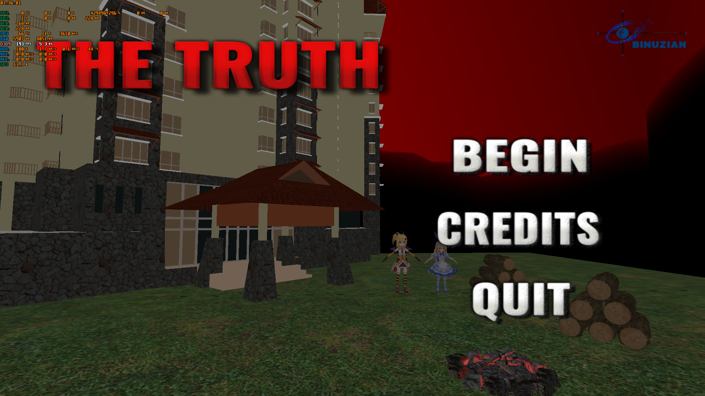

#  *The Thruth | Final Build*

> Sebuah permainan yang dibuat sebagai tugas akhir mata kuliah 'Grafika Komputer & Animasi' <br />
> Tugas ini sudah dapat kami anggap 'selesai' dikarenakan adanya alasan yang mendesak (>_<")

<br />



----

> Jangan lupa *join* Discord <br />
[](https://discord.gg/xGWdExk)

<br />

## Tentang Permainan

Dalam permainan ini, pemain diharuskan untuk mencari sebuah Gawai yang berada di dalam ruangan.

<br />

### Unduh -> *Compile* -> Jalankan

```sh
$ git clone https://github.com/bifeldy/GKA-TugasAkhir.git
```
atau download dari https://drive.google.com/drive/u/0/folders/1YW0HTTfcOXgQpteXUur3AP5c_to4AXsv

<br />

## Aplikasi Yang Dibutuhkan

* [Ms. Visual Studio 2017](https://visualstudio.microsoft.com/downloads/) - *Community Edition*
* [DirectX End-User Runtimes (June 2010)](https://www.microsoft.com/en-us/download/details.aspx?id=8109) - *DirectX 9 / Direct3D9*

<br />

## Pengembang

* [**Steven Reinhart**](https://www.FaceBook.com/Steven.Kam.73) - *Asset Creator*
* [**Basilius Bias Astho Christyono**](https://www.FaceBook.com/Bifeldy) - *Programmer*
* [**Reddy Kusuma Jaya**](https://www.FaceBook.com/Reddy.KusumaJaya) - *Asset Creator*
* [**Rexy Samuel**](https://www.FaceBook.com/Reximug) - *Music & Sound*

<br />

## Lisensi

Proyek ini berada di bawah Lisensi MIT - Harap melihat [LICENSE.md](LICENSE.md) untuk informasi tingkat lanjut.
